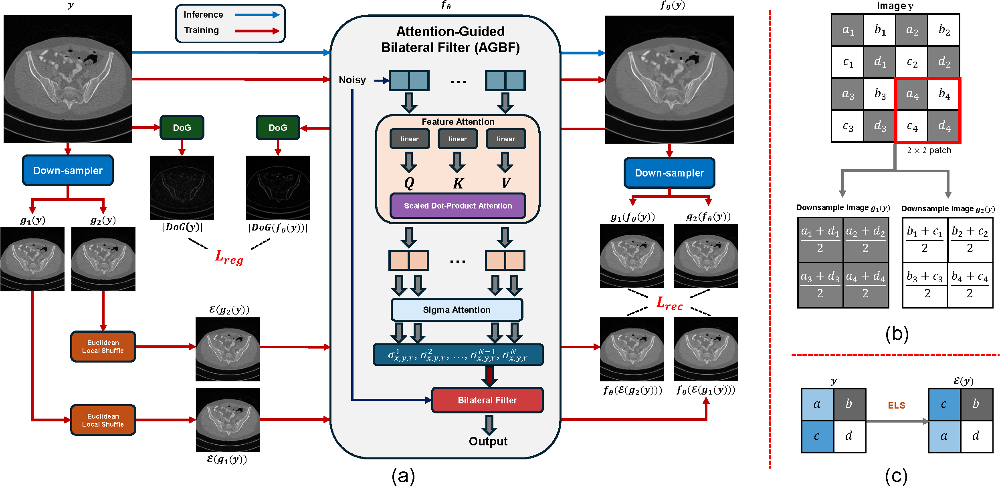

[](https://colab.research.google.com/drive/13bIhK2inxzjLfUUoLoltnAodFKb_YzXb?usp=sharing) [](https://arxiv.org/abs/2504.13519)
[](https://huggingface.co/papers/2504.13519)


# Filter2Noise: Interpretable Self-Supervised Single Low-Dose CT Image Denoising

<!-- Optional: Add a Table of Contents here if desired -->

## Table of Contents
- [Abstract](#abstract)
- [Method Overview](#method-overview)
- [Key Features](#key-features)
- [Installation](#installation)
- [Usage](#usage)
- [Important Parameters](#important-parameters)
- [Citation](#citation)
- [License](#license)


## Abstract

>Effective denoising is crucial in low-dose CT to enhance subtle structures and low-contrast lesions while preventing diagnostic errors. Supervised methods struggle with limited paired datasets, and self-supervised approaches often require multiple noisy images and rely on deep networks like U-Net, offering little insight into the denoising mechanism. To address these challenges, we propose an interpretable self-supervised single-image denoising framework---Filter2Noise (F2N). Our approach introduces an Attention-Guided Bilateral Filter that adapted to each noisy input through a lightweight module that predicts spatially varying filter parameters, which can be visualized and adjusted post-training for user-controlled denoising in specific regions of interest. To enable single-image training, we introduce a novel downsampling shuffle strategy with a new self-supervised loss function that extends the concept of Noise2Noise to a single image and addresses spatially correlated noise. On the Mayo Clinic 2016 low-dose CT dataset, F2N outperforms the leading self-supervised single-image method ([ZS-N2N](https://openaccess.thecvf.com/content/CVPR2023/papers/Mansour_Zero-Shot_Noise2Noise_Efficient_Image_Denoising_Without_Any_Data_CVPR_2023_paper.pdf)) by 4.59 dB PSNR while improving transparency, user control, and parametric efficiency. These features provide key advantages for medical applications that require precise and interpretable noise reduction.

## Method Overview


*Figure 1: (a) The F2N denoising pipeline. (b) The downsampling strategy, following [ZS-N2N](https://openaccess.thecvf.com/content/CVPR2023/papers/Mansour_Zero-Shot_Noise2Noise_Efficient_Image_Denoising_Without_Any_Data_CVPR_2023_paper.pdf). (c) Our proposed Euclidean Local Shuffle (ELS).*

## Key Features

-   ✨ **Interpretable Denoising**: Visualizable filter parameters (σx, σy, σr) for understanding the denoising behavior.
-   🚀 **Lightweight Architecture**: Only 1.8k parameters for single-stage (F2N-S1) and 3.6k for two-stage (F2N-S2).
-   💡 **Self-Supervised Learning**: No clean reference images needed for training.
-   🖱️ **User-Controlled Denoising**: Post-training adjustment of filter parameters for region-specific denoising.

## Installation

```bash
pip install -r requirements.txt
```

## Usage

### Basic Denoising

Run the main script to apply the denoising pipeline:

```bash
python filter2noise.py
```

### Interactive Demo

Launch the Gradio interface for interactive denoising and parameter adjustment:

```bash
python demo.py
```

The interactive demo allows you to:

-   Upload and denoise your own CT images.
-   Visualize the predicted filter parameters (σx, σy, σr).
-   Adjust filter parameters in specific regions using interactive controls.
-   See real-time updates of the denoised result.

## Important Parameters

### Lambda (λ)

The parameter `λ` in the loss function balances noise reduction (`L_rec`) and edge preservation (`L_reg`):

```math
L_\text{total} = L_\text{rec} + \lambda \cdot L_\text{reg}
```

-   **Low λ**: More aggressive noise reduction, potentially leading to blurring of fine details.
-   **High λ**: Better preservation of edges and structures, but may leave more residual noise.
-   **Recommended Starting Value**: `λ=350`. Adjust this value based on the specific image characteristics and desired denoising outcome.

### Other Parameters

-   `patch_size`: Controls the granularity of adaptive filtering (default: `8`). Smaller patches adapt more locally.
-   `num_stages`: Number of Attention-Guided Bilateral Filter (AGBF) stages (1 or 2). More stages can improve results but increase computation.
-   `in_channels`: Number of input image channels (default: `1` for grayscale CT images).

## Citation

If you find this work useful in your research, please consider citing our paper:

```bibtex
@misc{sun2025filter2noise,
      title={Filter2Noise: Interpretable Self-Supervised Single-Image Denoising for Low-Dose CT with Attention-Guided Bilateral Filtering}, 
      author={Yipeng Sun and Linda-Sophie Schneider and Mingxuan Gu and Siyuan Mei and Chengze Ye and Fabian Wagner and Siming Bayer and Andreas Maier},
      year={2025},
      eprint={2504.13519},
      archivePrefix={arXiv},
      primaryClass={eess.IV},
      url={https://arxiv.org/abs/2504.13519}, 
}
```

## License

This project is open source and available under the Creative Commons Attribution-NonCommercial 4.0 International License. See the [`LICENSE`](LICENSE) file for more details.
