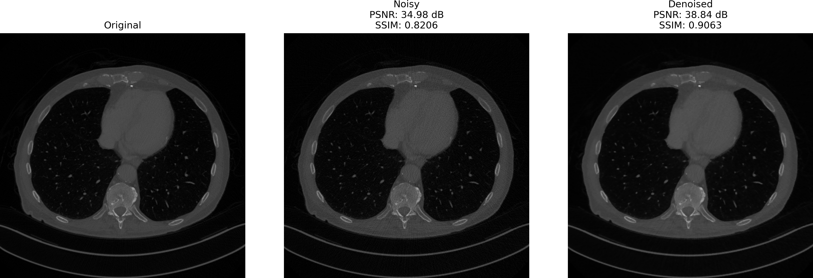
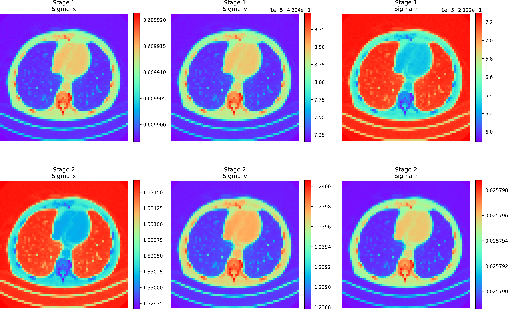

# Filter2Noise: Interpretable Self-Supervised Single Low-Dose CT Image Denoising

An interpretable and lightweight approach for self-supervised single-image denoising of low-dose CT images, using only 1.8k parameters.


## Overview

Filter2Noise is a novel framework that combines the interpretability of bilateral filtering with the adaptability of attention mechanisms. It achieves state-of-the-art performance in single-image denoising while maintaining full transparency and user control over the denoising process.

### Key Features

- **Interpretable**: Visualizable filter parameters (σx, σy, σr) for understanding the denoising behavior
- **Lightweight**: Only 1.8k parameters for single-stage (F2N-S1) and 3.6k for two-stage (F2N-S2)
- **Self-Supervised**: No clean reference images needed for training
- **User Control**: Post-training adjustment of filter parameters for region-specific denoising

## Results

Our method achieves excellent denoising performance while maintaining image quality:



The adaptability of our filter parameters across different stages:



## Installation

```bash
pip install -r requirements.txt
```

## Usage

```bash
python filter2noise.py
```

## Important Parameters

### Alpha Parameter (λ)

The alpha parameter (λ) in the loss function is **crucial** for balancing noise reduction and edge preservation:

```python
L_total = L_rec + λ * L_reg
```

**Important Note**: Careful tuning of λ is essential:

- **Low λ**: More aggressive noise reduction but potential blurring
- **High λ**: Better edge preservation but possibly more residual noise
- **Recommended**: Start with λ=350 and adjust based on your specific needs

### Other Key Parameters

- `patch_size`: Controls the granularity of adaptive filtering (default: 8)
- `num_stages`: Number of AGBF stages (1 or 2)
- `in_channels`: Number of input channels (default: 1 for CT images)

## License

MIT License, see [LICENSE](LICENSE).
